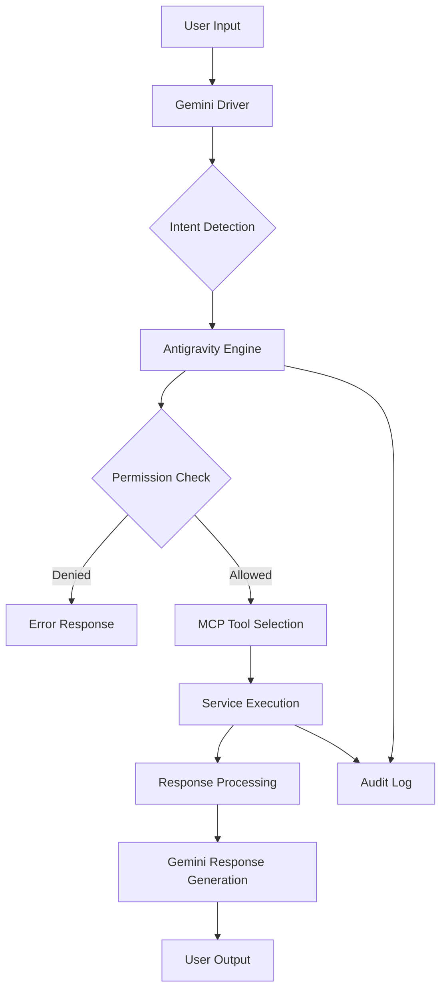

# SmarterBOT Spec v0.1 - Contrato Cognitivo

## Vision del Sistema

SmarterBOT es un CRM cognitivo que orchestra múltiples servicios (Chatwoot, Odoo, n8n, pagos) a través de una capa de inteligencia controlada por MCP (Model Context Protocol).

## Definiciones Fundamentales

### Tenant (Organización)
```typescript
interface Tenant {
  id: string;                    // UUID único
  name: string;                  // Nombre legal
  domain: string;                // dominio.customers.cl
  settings: {
    timezone: string;
    currency: string;             // CLP por defecto
    language: string;             // es-CL por defecto
  };
  limits: {
    max_users: number;
    max_conversations_per_month: number;
    allowed_features: string[];
  };
  created_at: Date;
  updated_at: Date;
}
```

### Customer (Cliente Final)
```typescript
interface Customer {
  id: string;                     // UUID único
  tenant_id: string;              // Aislamiento multi-tenant
  personal_info: {
    name: string;
    email: string;
    phone: string;
    rut?: string;                // Chile específico
  };
  status: 'active' | 'inactive' | 'pending';
  source: 'web' | 'whatsapp' | 'manual' | 'api' | 'import';
  metadata: {
    lead_score: number;           // 0-100
    last_contact: Date;
    total_spent: number;          // CLP
    conversation_count: number;
  };
  created_at: Date;
  updated_at: Date;
}
```

### Conversation (Interacción)
```typescript
interface Conversation {
  id: string;
  tenant_id: string;
  customer_id: string;
  channel: 'whatsapp' | 'webchat' | 'email' | 'phone';
  status: 'open' | 'resolved' | 'snoozed' | 'pending';
  assigned_to?: string;          // User ID
  messages: Message[];
  metadata: {
    sentiment_score?: number;     // -1 a 1
    priority: 'low' | 'medium' | 'high';
    tags: string[];
  };
  created_at: Date;
  updated_at: Date;
}

interface Message {
  id: string;
  conversation_id: string;
  content: string;
  sender_type: 'customer' | 'agent' | 'bot';
  sender_id: string;
  message_type: 'text' | 'image' | 'file' | 'template';
  created_at: Date;
}
```

## Roles y Permisos

### Bot Roles
```typescript
enum BotRole {
  SALES_ASSISTANT = 'sales_assistant',
  SUPPORT_AGENT = 'support_agent', 
  ADMIN_BOT = 'admin_bot'
}

interface BotPermissions {
  role: BotRole;
  allowed_tools: string[];
  restricted_resources: string[];
  rate_limit: {
    requests_per_minute: number;
    daily_limit?: number;
  };
  data_access: {
    can_create_customers: boolean;
    can_read_payments: boolean;
    can_create_payments: boolean;
    can_access_other_tenants: boolean;
  };
  audit_required: boolean;
}
```

### Role Definitions
```typescript
const ROLE_DEFINITIONS: Record<BotRole, BotPermissions> = {
  [BotRole.SALES_ASSISTANT]: {
    role: BotRole.SALES_ASSISTANT,
    allowed_tools: [
      'crm.create_lead',
      'crm.get_customer', 
      'chat.send_message',
      'chat.get_conversations'
    ],
    restricted_resources: [
      'payments://*',
      'system://*',
      'tenant://*/config'
    ],
    rate_limit: { requests_per_minute: 30, daily_limit: 1000 },
    data_access: {
      can_create_customers: true,
      can_read_payments: false,
      can_create_payments: false,
      can_access_other_tenants: false
    },
    audit_required: false
  },

  [BotRole.SUPPORT_AGENT]: {
    role: BotRole.SUPPORT_AGENT,
    allowed_tools: [
      'crm.get_customer',
      'crm.update_customer',
      'chat.send_message', 
      'chat.get_conversations',
      'payments.get_status'
    ],
    restricted_resources: [
      'payments://create_*',
      'system://*',
      'tenant://*/config'
    ],
    rate_limit: { requests_per_minute: 20, daily_limit: 800 },
    data_access: {
      can_create_customers: false,
      can_read_payments: true,    // Solo lectura
      can_create_payments: false,
      can_access_other_tenants: false
    },
    audit_required: false
  },

  [BotRole.ADMIN_BOT]: {
    role: BotRole.ADMIN_BOT,
    allowed_tools: ['*'],          // Acceso completo
    restricted_resources: [],      // Sin restricciones
    rate_limit: { requests_per_minute: 10, daily_limit: 500 },
    data_access: {
      can_create_customers: true,
      can_read_payments: true,
      can_create_payments: true,
      can_access_other_tenants: true
    },
    audit_required: true          // Toda acción auditada
  }
};
```

## Business Rules (Reglas de Negocio)

### Lead Management
1. **Lead Scoring Automático**: Nuevo lead recibe puntuación basada en:
   - Fuente del lead (web=30, whatsapp=50, manual=70)
   - Calidad del email (dominio corporativo=+20)
   - Presencia de teléfono (+10)
   - Interacción previa (+15)

2. **Asignación Automática**: Leads con score > 60 se asignan automáticamente al agente con menor carga.

3. **Deduplication**: Email + teléfono únicos por tenant.

### Conversation Management
1. **SLA por Canal**:
   - WhatsApp: Primera respuesta < 5 minutos
   - Webchat: Primera respuesta < 2 minutos
   - Email: Primera respuesta < 4 horas

2. **Escalación Automática**:
   - Sin respuesta en 30 minutos → escalar a supervisor
   - Sentimiento negativo (> -0.7) → alerta prioritaria
   - Mencionar "gerente" o "supervisor" → escalar inmediato

### Payment Processing
1. **Límites por Rol**:
   - Sales Assistant: Puede crear pagos hasta $50.000
   - Support Agent: Solo consulta estado
   - Admin Bot: Sin límites

2. **Validación Anti-Fraude**:
   - Más de 3 pagos fallidos en 1 hora → bloquear
   - Monto > $500.000 requiere aprobación admin
   - Pagos internacionales requieren verificación adicional

## Data Flow Architecture

### Request Flow


### Service Orchestration
```typescript
interface ServiceOrchestrator {
  // CRM Operations
  createCustomer(data: CreateCustomerRequest): Promise<Customer>;
  getCustomer(id: string, tenant_id: string): Promise<Customer>;
  updateCustomer(id: string, updates: Partial<Customer>): Promise<Customer>;
  
  // Communication
  sendMessage(data: SendMessageRequest): Promise<Message>;
  getConversations(filters: ConversationFilters): Promise<Conversation[]>;
  
  // Payments
  createPaymentIntent(data: PaymentRequest): Promise<Payment>;
  getPaymentStatus(payment_id: string): Promise<PaymentStatus>;
  
  // Analytics
  getMetrics(tenant_id: string, period: DateRange): Promise<Metrics>;
}
```

## Security Model

### Multi-Tenant Isolation
- **Data Separation**: Cada tenant con ID único en todas las tablas
- **Query Filtering**: Automático por tenant_id en todas las queries
- **Cross-Tenant Blocking**: Acceso inter-tenant solo con rol admin

### Authentication & Authorization
1. **API Keys**: Cada tenant recibe API keys por entorno (dev/staging/prod)
2. **JWT Tokens**: Sesiones de usuarios con claims de tenant + role
3. **Rate Limiting**: Por tenant, IP, y rol combinado
4. **Audit Trail**: Todas las acciones modificativas loggeadas

### Compliance Requirements
- **GDPR**: Derecho al olvido y exportación de datos
- **Ley Chilena**: Protección de datos personales
- **PCI DSS**: Manejo seguro de información de pago

## Monitoring & Observability

### Key Metrics
```typescript
interface SystemMetrics {
  performance: {
    avg_response_time_ms: number;
    p95_response_time_ms: number;
    error_rate_percent: number;
    throughput_rps: number;
  };
  
  business: {
    leads_created_per_day: number;
    conversations_resolved_per_day: number;
    payment_success_rate_percent: number;
    customer_satisfaction_score: number;
  };
  
  system: {
    active_conversations: number;
    queue_length: number;
    agent_utilization_percent: number;
    service_availability_percent: number;
  };
}
```

### Alerting Rules
- **High Error Rate** > 5% durante 5 minutos
- **Response Time** P95 > 2 segundos
- **Queue Length** > 100 conversaciones pendientes
- **Payment Failures** > 10% en ventana de 1 hora
- **Unauthorized Access** > 10 intentos en 1 minuto

---

## Version Control

**Version**: v0.1  
**Status**: Draft - Pending Implementation  
**Next Steps**: Implementar `crm.create_lead` como proof-of-concept  
**Target Date**: End of current sprint